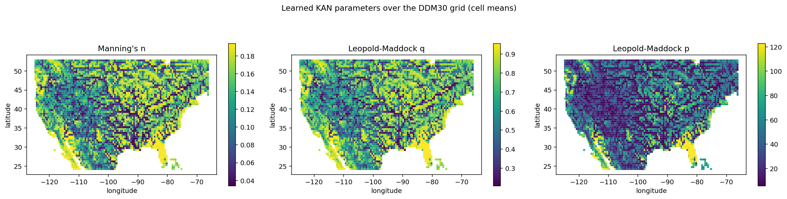
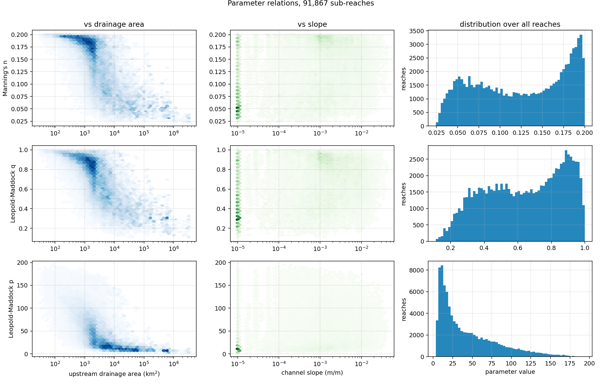
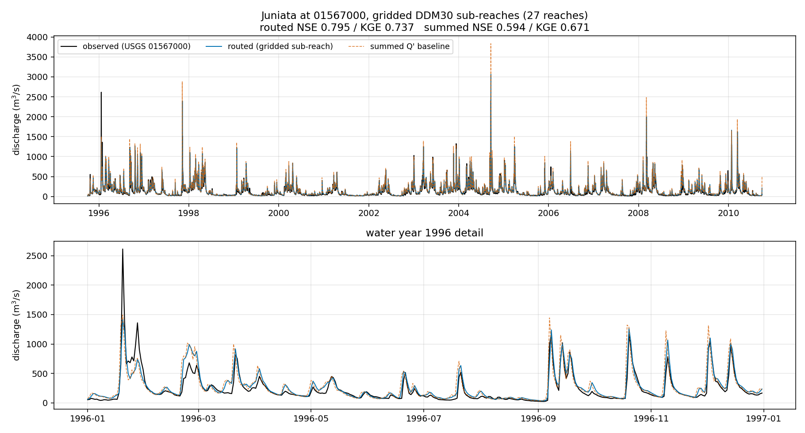
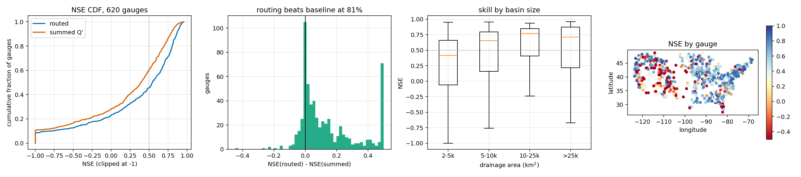
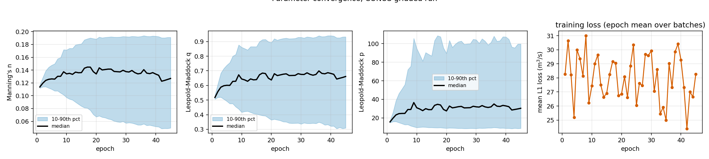
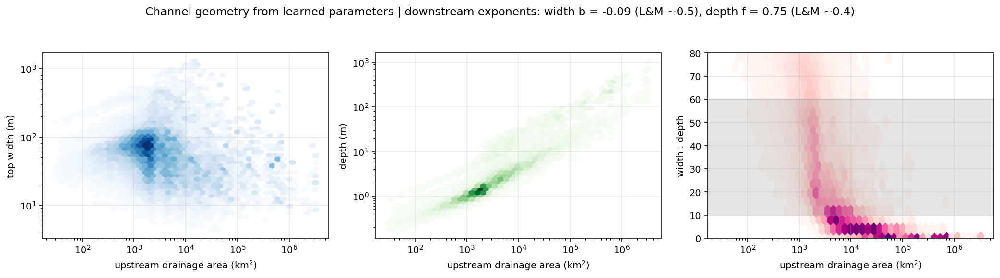

# Methods: gridded differentiable routing on the ISIMIP DDM30 network

A sample methods section describing how the gridded routing path in DDR works and where
every input comes from. Written to be read by a collaborator who knows hydrology but has
not seen this code. Numbers reported here come from the runs in
`examples/juniata_gridded/`; the operational recipe is in
[Gridded inputs](gridded_data.md).

## 1. Overview

Differentiable routing models learn channel parameters from observed streamflow by
propagating gradients through the routing equations themselves (Bindas et al., 2024).
DDR implements this for vector river networks derived from MERIT Hydro, where each
routing element is a mapped river reach. We extended it to a *gridded* network, in which
routing elements are derived from a global drainage-direction raster rather than mapped
flowlines. The motivation is comparability: the ISIMIP simulation rounds distribute a
common 0.5° river network, so a model built on it can be compared directly against global
water models, and a parameterization learned on it transfers across simulation rounds
without re-deriving the network.

The gridded path shares the routing solver, the neural parameterization, and the loss
with the vector path. Only the network topology, the channel attributes, and the lateral
inflow differ. This section describes those three components, then the routing scheme,
the parameter learning, and the evaluation.

## 2. Routing network

### 2.1 Source

The network derives from DDM30 (Döll & Lehner, 2002), the drainage-direction map
distributed with the ISIMIP3b input data as the river-routing product
(DOI: 10.48364/ISIMIP.865475), remapped to the CRU land mask. DDM30 is a global
0.5° × 0.5° raster in which each of 67,424 land cells carries a D8 flow-direction code, a
basin identifier, and a channel slope. We downloaded the three NetCDF files directly from
the ISIMIP file server rather than the search portal, which was frequently unreachable.

Three deviations from the published documentation were found on inspection and are worth
recording, since they affect any reimplementation. The documented code 9, denoting cells
present in the CRU mask but absent from the original DDM30, never appears; those 1,326
cells instead carry a flow direction of zero with basin identifiers above 70,000 and a
placeholder slope of 0.001 m m⁻¹. A further 782 cells carry a flow direction of −1, which
is undocumented and denotes inland terminals. Any code outside the range 1 to 8 must
therefore be treated as a terminal. Finally, the Lake Ladoga transport cells belong to
basin 17102, not the documented 17012.

### 2.2 Graph construction

Each cell was assigned a flat identifier `row × 720 + col`, with row zero at 55.75°S,
which fits in a 32-bit integer and makes the cell coordinate recoverable by integer
division. Flow-direction codes were converted to row and column offsets, with longitude
wrapping modulo 720 so that cells on the antimeridian connect correctly. The resulting
downstream map was inverted into an upstream adjacency dictionary and passed to the
existing graph builder, which performs a topological sort and emits a strictly
lower-triangular sparse adjacency matrix in binsparse COO form.

A D8 raster is dendritic by construction, since every cell has exactly one downstream
neighbour or none, so no cycle removal was required. The global network contains 67,424
nodes and 55,866 edges. Correctness was confirmed by an exact identity: the 3,896 weakly
connected components plus 7,662 isolated cells sum to 11,558, which equals the number of
unique basin identifiers in the source raster. Channel length was computed as the
great-circle distance between the centres of each cell and its downstream neighbour,
giving 6.5 to 78.6 km with a mean of 51 km; terminal and isolated cells were assigned the
0.5° meridional length.

### 2.3 Sub-reach discretization

A 0.5° cell is far longer than the distance a flood wave travels in one hourly timestep,
which places the Muskingum-Cunge scheme in a poorly conditioned regime (Section 4.2). We
therefore optionally subdivide each cell into a chain of shorter reaches, with the last
sub-reach of a cell draining to the first sub-reach of its downstream neighbour. Because
the parent ordering is topological, the expanded network remains strictly
lower-triangular. Sub-reach identifiers encode their parent as `cell_id × 1000 + index`,
with the upstream-most sub-reach first, so per-cell attributes and forcing expand to
sub-reaches by lookup rather than requiring their own stores.

Reach length was chosen to place the Courant number near unity. Both Muskingum sign
conditions, dt ≥ 2KX and dt ≤ 2K(1−X) with K = L/c the wave travel time, reduce on
division by K to a single band on the Courant number C = c·dt/L:

$$2X \le C \le 2(1-X)$$

Because the Cunge weighting X cannot exceed 0.5, C = 1 always lies inside this band
irrespective of X, which makes unity a principled target rather than a tuned choice.
Substituting Cunge's expression X = ½(1 − β/L), where β = Q/(T·S·c) has units of length,
converts the band into a window on reach length, c·dt − β ≤ L ≤ c·dt + β. The ideal reach
is therefore c·dt, with a tolerance that narrows for steep, wide, or low-flow cells.
Since celerity depends on discharge, which routing itself computes, we sized the network
once using the summed lateral inflow (Section 5.2) as the reference discharge. Reaches
were floored at 1 km, and cells without forcing fell back to a fixed 6 km target. Applied
to the conterminous United States this yielded 91,867 sub-reaches of 1.0 to 27.8 km from
5,198 cells, with a median Courant number of 0.96.

## 3. Channel attributes

### 3.1 Provenance and the aggregation rule

Attributes follow the set used by Song et al. (2025), whose national-scale differentiable
model defines the predictors for the routing parameterization. Every attribute was derived
from a natively gridded source and aggregated onto 0.5° cells; basin-averaged values were
never resampled onto the grid, since interpolating a catchment-mean quantity onto cells
that do not align with catchment boundaries introduces error that is difficult to bound.
Aggregation used exact coverage-weighted zonal means, with each cell represented as a
polygon and each source raster reprojected into its own coordinate reference system before
overlay so that weights are true areas. Rasters were processed in 30° blocks so that a
global 30 arc-second layer is never held in memory.

Table 1 lists the sources. Where a source and its scale differ from the reference study,
the reason is given.

**Table 1.** Attribute sources.

| Attribute | Source | Native resolution | Notes |
|---|---|---|---|
| Mean elevation, mean slope | GMTED2010 (Danielson & Gesch, 2011) | 7.5″ (30″ globally) | MERIT Hydro stops at 60°N, which would exclude 17,238 cells of the global grid; GMTED also matches the USGS-DEM lineage of the reference study. Slope is computed at the raster's own pixel size, with east-west spacing scaled by cos(latitude), then averaged. |
| Clay, sand, silt fraction | SoilGrids 2.0 (Poggio et al., 2021) | 1 km aggregate, 0–5 cm | Distributed in Goode Homolosine; reprojected before overlay. Values are g kg⁻¹ and divided by ten. |
| Saturated conductivity, van Genuchten α and n, organic matter, water content at field capacity and saturation | HiHydroSoil v2.0 (Simons et al., 2020) | 250 m, 0–5 cm | Stored as integers scaled by 10⁴. |
| Porosity, permeability | GLHYMPS (Gleeson et al., 2014) | polygon | Permeability is log₁₀(m²); the arithmetic mean of the logarithm is the geometric mean of conductivity, which is the standard averaging. Overlay performed in the source's equal-area projection. |
| Open-water fraction | GLWD v2 (Lehner & Döll, 2004) | 15″ | Sum of the six open-water classes, matching the reference study's definition of the fraction of open water. |
| NDVI | MOD13A2 | 1 km | Multi-year mean, 2000–2019. |
| Snow-cover fraction | MOD10A1 | 500 m (5 km export) | Multi-year mean, 2000–2020, with fill codes masked. Exported at the 0.05° resolution of the monthly product used by the reference study. |
| Mean precipitation, mean temperature | WorldClim 2.1 (Fick & Hijmans, 2017) | 30″ | Bioclimatic variables 12 and 1. |
| Potential evapotranspiration | Derived | 30″ | Hargreaves method from WorldClim monthly minimum and maximum temperature, with extraterrestrial radiation from FAO-56 (Allen et al., 1998), summed to an annual total. |
| Aridity | Derived | – | PET divided by precipitation, with precipitation floored at 1 mm yr⁻¹, the reporting resolution of the source. Hyper-arid cells round to zero and would otherwise give an undefined ratio. |
| Precipitation and PET seasonality | Derived | 30″ | Walsh and Lawler (1981) seasonality index over the monthly stacks. |
| Snowfall fraction | Derived | 30″ | Precipitation-weighted, with the snow share ramping linearly from unity at −1 °C to zero at +3 °C on monthly mean temperature. |
| Cell area | Derived | – | Spherical area of the 0.5° cell. |
| Upstream area | Derived | – | Cumulative area over the routing network: a headwater cell carries its own area, and each downstream cell adds all area above it. Reported as log₁₀ km². |

Several sources contain artefacts that silently corrupt a cell mean unless handled. The
saturation water content in HiHydroSoil contains an unflagged 32-bit integer maximum,
which we removed by bounding raw values before aggregation. SoilGrids reports zero rather
than nodata over permanent water, so cells whose three texture fractions sum to zero were
set to missing, which brought them into agreement with HiHydroSoil. Rasters retrieved
through Google Earth Engine carry a trailing fill-mask band that must be skipped.

**Figure 1.** Channel parameters predicted from the attributes of Table 1, averaged to
their 0.5° cell, after 45 training epochs. Colour scales are clipped to the 2nd and 98th
percentiles. Roughness is highest on the Gulf and Atlantic coastal plains and lowest along
major river corridors, a pattern the network infers from attributes alone rather than from
any spatial prior.

### 3.2 Products

Attributes were written in three forms from a single build: a NetCDF file indexed by cell
identifier, matching the layout of the existing MERIT attribute store so that the reader
requires no modification; an icechunk store keyed on the same identifiers; and the same
variables on the native 280 × 720 latitude-longitude grid for comparison against
gridded model output. The conterminous United States store contains 25 attributes for
5,198 cells and the global store the same attributes for all 67,424 cells.

## 4. Routing

### 4.1 Scheme

Flow is routed with the differentiable Muskingum-Cunge implementation of Bindas et al.
(2024), unchanged. Channel geometry is trapezoidal, with top width from a Leopold and
Maddock (1953) power law, w = p·d^q, and velocity from Manning's equation. Kinematic
celerity is c = v·β, with β derived from the trapezoidal section rather than the
wide-rectangular limit of 5/3. The Cunge weighting factor is set per timestep by matching
numerical to physical diffusion and clamped to [0, 0.5]. The routing timestep is one hour.

At each timestep the scheme solves

$$(\mathbf{I} - c_1 \mathbf{N})\,\mathbf{Q}_{t+1} = c_2 \mathbf{N} \mathbf{Q}_t + c_3 \mathbf{Q}_t + c_4 \mathbf{q}'$$

where **N** is the network adjacency and q′ the lateral inflow. Because the adjacency is
strictly lower-triangular in topological order, the system is solved by forward
substitution in a single pass.

### 4.2 The negative-coefficient regime

At 0.5° the reach length is 33 to 79 km, giving travel times of five to thirteen hours
against an hourly timestep. The Cunge weighting consequently saturates at its cap of 0.5,
and the coefficient c₁ is negative for approximately 88% of cell and flow states. This is
a property of the discretization rather than an error, and two considerations bound its
consequences. First, the coefficients satisfy c₁ + c₂ + c₃ = 1 and c₄ = c₁ + c₂ to within
2 × 10⁻⁷, from which it follows that the steady state of the scheme is exactly topological
accumulation; the discretization therefore cannot bias the water balance. Second, the
implicit solve remains stable, producing negative discharge in 0.36% of cell-hours during
a synthetic flood and 0.049% in a two-year continental simulation.

Sub-reach discretization to Courant unity eliminates the regime, reducing negative solves
by an order of magnitude to 0.005%. It did not, however, improve daily skill: paired
across 321 gauges the median change in Nash-Sutcliffe efficiency was −0.0002, with 49.8%
of gauges improving. We attribute this to the evaluation timestep, since subdivision alters
sub-daily wave timing that daily aggregation removes. Sub-reach networks are nonetheless
used by default on the argument that a well-conditioned operator should yield cleaner
gradients during training, a claim that remains untested.

The benchmark reported here reads the same area-weighted lateral inflow as training
(Section 5.1). An earlier implementation assigned each catchment's discharge to the cell
containing its flowline midpoint; the two agree in aggregate, with a paired median
difference of 0.0003 in efficiency across 321 gauges, but disagree by more than 0.05 at 71
of them, so they are not interchangeable for an individual basin.

## 5. Lateral inflow and observations

### 5.1 Runoff

Lateral inflow was taken from the differentiable hydrologic model of Song et al. (2025),
which provides daily runoff for approximately 197,000 MERIT unit catchments over
1980–2020. Because runoff is a volumetric flux per catchment rather than an intensive
field, transferring it to cells is mass-conserving aggregation and not interpolation: each
catchment's discharge was divided among the cells its polygon overlaps in proportion to the
overlapping area, and the contributions summed per cell. The overlay produced 278,920
catchment-cell pairs from 197,088 catchments, an average of 1.42 cells per catchment,
which indicates that roughly 40% of catchments straddle a cell boundary and would have
been misplaced by assigning each catchment to the cell containing its flowline midpoint.
Aggregation conserved volume to 8 × 10⁻⁸ relative error. The resulting store covers 4,085
cells; the continental mean of 79,574 m³ s⁻¹ is consistent with roughly 0.3 m yr⁻¹ of
runoff over 8 × 10⁶ km². Daily values are repeated to hourly at routing time.

### 5.2 Gauges

Streamflow observations are daily USGS records. Gauges were matched to cells by searching
the 3 × 3 neighbourhood of the gauge coordinate and selecting the cell minimising the
absolute logarithm of the ratio between the cell's accumulated area and the reported gauge
drainage area, accepting ratios between 0.7 and 1.4. Nearest-centre assignment was tested
first and rejected: it misplaced approximately half of the large gauges, in one case by a
factor of 201 in drainage area.

Grid resolution imposes a hard limit on which gauges are usable. A 0.5° cell is
approximately 2,350 km², so a basin smaller than a single routing element cannot be
represented. Of the 3,211 gauges in the reference gauge set, 2,416 fall below this
threshold. Restricting to basins above 2,000 km² leaves 890 candidates, of which 667 match
within tolerance at a median area ratio of 1.01, and 620 also satisfy a 90% observation
coverage requirement over the evaluation period.

## 6. Parameter learning

Manning's roughness and the two Leopold and Maddock coefficients are predicted per reach
by a Kolmogorov-Arnold network from ten normalised attributes: clay and sand fraction,
aridity, mean elevation, mean precipitation, NDVI, mean slope, log upstream area,
potential evapotranspiration, and porosity. The network has two hidden layers of width 21.
Its outputs pass through a sigmoid and are rescaled to physical bounds, with the width
coefficient mapped in logarithmic space. Attributes were normalised with statistics
computed over all continental cells rather than over the training basins, so that a
parameterization trained on one region remains applicable elsewhere.

Sub-reaches inherit their parent cell's attributes, with the exception of upstream area,
which is recomputed per reach from accumulated area so that the network sees variation
within a cell.

**Figure 6.** Learned parameters against upstream area and channel slope, with their
distributions across all reaches. The network resolves a continuous range rather than a
single value, which is the behaviour a continental attribute set is meant to produce and
which a four-cell basin cannot.

Training minimises the mean absolute error between routed and observed daily discharge
over randomly sampled 90-day windows, with the first five days excluded as warm-up.
Gradients propagate through the routing solve to the network weights. Optimisation used
Adam with gradient-norm clipping and a halved learning rate at the midpoint of training.
Predictions are scaled by the inverse of the gauge area ratio during both training and
evaluation, so that the parameterization is not required to absorb the area mismatch.

## 7. Evaluation

Skill is reported as Nash-Sutcliffe efficiency and Kling-Gupta efficiency on daily
discharge over a period held out from training, with a 30-day warm-up discarded. Every
comparison is made against a summed-inflow baseline, in which the same lateral inflow is
accumulated downstream through the network without routing physics. This baseline is the
relevant control: a routing model that does not exceed it has not demonstrated that its
learned parameters do any work, regardless of its absolute skill.

**Figure 2.** Routed and unrouted discharge against observation at USGS 01567000 over the
held-out period, with water year 1996 enlarged below. The gridded network reproduces
recession behaviour that the summed-inflow baseline, which has no routing physics, cannot.

**Table 2.** Held-out performance. Juniata results are for a single gauge over 1995–2010;
continental results are medians across 620 gauges over 1995–1997.

| Configuration | Reaches | NSE routed | NSE baseline | KGE routed |
|---|---|---|---|---|
| Juniata (USGS 01567000), trained 30 epochs | 27 | 0.795 | 0.594 | 0.737 |
| Conterminous United States, trained 45 epochs | 91,867 | 0.542 | 0.390 | 0.618 |

**Figure 5.** Distribution of efficiency across the 620 continental gauges: cumulative
distribution against the baseline, the per-gauge difference between them, efficiency
grouped by basin size, and the spatial pattern.

Routing exceeded the baseline at 81% of continental gauges, and 336 of 620 gauges reached
an efficiency above 0.5. Skill increases with basin size, from a median near 0.39 for
basins of 2,000 to 5,000 km² to approximately 0.70 above 10,000 km², which is the expected
consequence of representing a basin with progressively more routing elements.

## 8. Verification

Beyond conventional unit tests, the built products are checked by 67 assertions in four
families. Network assertions confirm that every cell has at most one downstream neighbour,
that the adjacency is strictly lower-triangular, that no cell drains to itself, that every
downstream neighbour is one of the eight adjacent cells under longitude wrapping, that no
edge crosses a basin boundary, and that accumulated area both conserves total land area and
increases monotonically downstream. Unit assertions confirm that every attribute lies
within a documented physical range and report missing-data fractions. Consistency
assertions confirm that texture fractions sum to unity, that field capacity does not exceed
saturation, that aridity equals the ratio of its constituents, and that accumulated area is
never below a cell's own area. Stability assertions evaluate the Muskingum coefficients at
area-scaled discharges and route a synthetic flood through the real network, confirming
finiteness, non-negativity, and convergence to topological accumulation.

## 9. Known limitations

Three limitations bear on interpretation of learned parameters. The roughness
parameterization initialises at the midpoint of its bounds, 0.111, which is a floodplain
rather than a channel value; after 45 epochs the median settles near 0.127 but the
interdecile range presses the upper bound, indicating that the parameter is absorbing
error it cannot otherwise fit (Figure 3). The implied downstream hydraulic geometry is inconsistent
with observation, with a width exponent near zero against an expected value of
approximately 0.5 and a depth exponent of 0.75 against approximately 0.4, which follows
from an objective that constrains discharge but not channel shape (Figure 4). Finally, basins near the
resolution limit are represented by one or two routing elements, so skill in the smallest
size class reflects discretization as much as parameterization.

**Figure 3.** Median and interdecile range of each parameter across all 91,867 reaches
against training epoch, with mean training loss. The medians stabilise, but the ranges
widen for the whole run and reach the bounds of roughness and the depth exponent, which is
the signature of a parameter compensating for error rather than converging.

**Figure 4.** Top width, depth, and their ratio against upstream area, computed from the
learned parameters at an area-scaled reference discharge. The shaded band marks the width
to depth ratio of natural channels. Depth increases too steeply with discharge and width
barely increases at all, so the largest rivers are rendered deep and narrow.

## References

Allen, R. G., Pereira, L. S., Raes, D., & Smith, M. (1998). *Crop evapotranspiration:
Guidelines for computing crop water requirements*. FAO Irrigation and Drainage Paper 56.

Bindas, T., Tsai, W.-P., Liu, J., Rahmani, F., Feng, D., Bian, Y., Lawson, K., & Shen, C.
(2024). Improving river routing using a differentiable Muskingum-Cunge model and
physics-informed machine learning. *Water Resources Research*, 60(1), e2023WR035337.
https://doi.org/10.1029/2023WR035337

Danielson, J. J., & Gesch, D. B. (2011). *Global multi-resolution terrain elevation data
2010 (GMTED2010)*. U.S. Geological Survey Open-File Report 2011-1073.

Döll, P., & Lehner, B. (2002). Validation of a new global 30-min drainage direction map.
*Journal of Hydrology*, 258(1-4), 214-231.

Fick, S. E., & Hijmans, R. J. (2017). WorldClim 2: New 1-km spatial resolution climate
surfaces for global land areas. *International Journal of Climatology*, 37(12), 4302-4315.

Gleeson, T., Moosdorf, N., Hartmann, J., & van Beek, L. P. H. (2014). A glimpse beneath
Earth's surface: GLobal HYdrogeology MaPS (GLHYMPS). *Geophysical Research Letters*,
41(11), 3891-3898. Data: https://doi.org/10.5683/SP2/DLGXYO

Lehner, B., & Döll, P. (2004). Development and validation of a global database of lakes,
reservoirs and wetlands. *Journal of Hydrology*, 296(1-4), 1-22.

Leopold, L. B., & Maddock, T. (1953). *The hydraulic geometry of stream channels and some
physiographic implications*. U.S. Geological Survey Professional Paper 252.

Lin, P., Pan, M., Beck, H. E., Yang, Y., Yamazaki, D., Frasson, R., et al. (2019). Global
reconstruction of naturalized river flows at 2.94 million reaches. *Water Resources
Research*, 55(8), 6499-6516. https://doi.org/10.1029/2019WR025287

Poggio, L., de Sousa, L. M., Batjes, N. H., Heuvelink, G. B. M., Kempen, B., Ribeiro, E.,
& Rossiter, D. (2021). SoilGrids 2.0: Producing soil information for the globe with
quantified spatial uncertainty. *SOIL*, 7(1), 217-240.

Simons, G. W. H., Koster, R., & Droogers, P. (2020). *HiHydroSoil v2.0: A high resolution
soil map of global hydraulic properties*. FutureWater Report 213.

Song, Y., Bindas, T., Shen, C., Ji, H., Knoben, W. J. M., Lonzarich, L., et al. (2025).
High-resolution national-scale water modeling is enhanced by multiscale differentiable
physics-informed machine learning. *Water Resources Research*, 61(4).
https://doi.org/10.1029/2024WR038928

Walsh, R. P. D., & Lawler, D. M. (1981). Rainfall seasonality: Description, spatial
patterns and change through time. *Weather*, 36(7), 201-208.

Yamazaki, D., Ikeshima, D., Sosa, J., Bates, P. D., Allen, G. H., & Pavelsky, T. M. (2019).
MERIT Hydro: A high-resolution global hydrography map based on latest topography dataset.
*Water Resources Research*, 55(6), 5053-5073.
